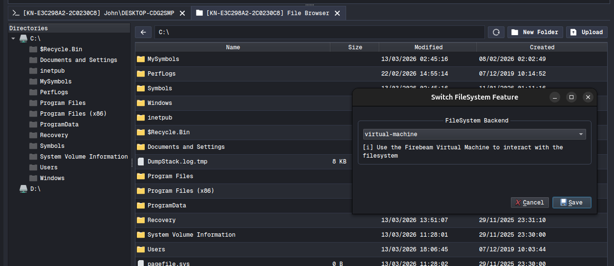

# vm-filesystem

A Firebeam bytecode to perform Filesystem interacting while also monkey-patch the python function for the Havoc Interface File Browser interaction, allowing to interact with the remote filesystem without needing to have the filesystem embedded.

This repository also is a representation of what is possible via the Firebeam Virtual Machine and the modularity capacity of the Client itself, allowing alternate methods of filesystem interaction from both agent console and User Interface via monkey-patched functions. 

[Video Demonstration](https://www.youtube.com/watch?v=MdW7zTTYWOE)

## monkey-patching for bytecode execution 

The script will monkey-patch the methods used by the File Browser to issue tasks to the agent and replace them with bytecode interpretation and execution of the equivalent task through an alternate method, thereby demonstrating the capabilities available to the operator and external tooling.



While also displaying how to generate custom user interfaces to change the behavior or configuration of features, such as in this case switching in-between extension based and virtual-machine based filesystem interaction.

## build

The operator first needs to download the `firebeam-sdk` from the customer portal and extract it locally. Afterwards specify the sdk path via makefile to build the project. 

```
$ make SDK=../firebeam
[*] building src/drives.obj as vm-filesys-drives.x64.exe
[*] building src/ls.obj as vm-filesys-ls.x64.exe
[*] building src/mkdir.obj as vm-filesys-mkdir.x64.exe
[*] building src/move.obj as vm-filesys-move.x64.exe
[*] building src/remove.obj as vm-filesys-remove.x64.exe
```

Once build, the operator can now load the script into the client.
